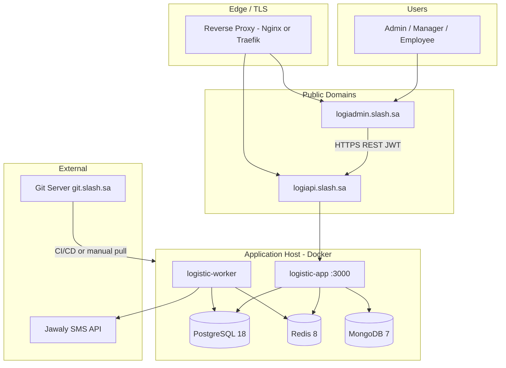
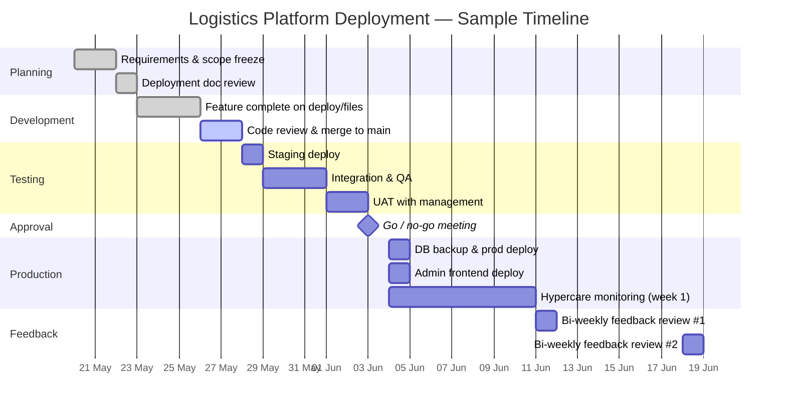

# Logistics Platform — Deployment Plan & Workflow

**Document version:** 1.0  
**Date:** 25 May 2026  
**Project:** LogisticsApp (Slash)  
**Domains:**

| Domain | Role |
|--------|------|
| **logiapi.slash.sa** | Backend API (this repository — Express + Prisma + workers) |
| **logiadmin.slash.sa** | Admin dashboard (frontend — consumes API; separate deploy artifact) |

**Branch / release reference:** `deploy/files` → `main` (Git: `git.slash.sa/Slash-Git/LogisticsApp`)

---

## Table of Contents

1. [Executive Summary](#1-executive-summary)
2. [Architecture & Domain Linkages](#2-architecture--domain-linkages)
3. [Environment Setup](#3-environment-setup)
4. [Deployment File (Step-by-Step)](#4-deployment-file-step-by-step)
5. [Rollback Strategies](#5-rollback-strategies)
6. [Worker Flow & Roles](#6-worker-flow--roles)
7. [Timeline (Gantt)](#7-timeline-gantt)
8. [Collaboration Tools](#8-collaboration-tools)
9. [Comprehensive Plan — Goals, Success, Risks](#9-comprehensive-plan--goals-success-risks)
10. [Post-Launch Monitoring & Feedback](#10-post-launch-monitoring--feedback)
11. [VPS Sizing Guide (EC2 Ubuntu)](#11-vps-sizing-guide-ec2-ubuntu)
12. [Appendix A — Environment Variables](#appendix-a--environment-variables)
13. [Appendix B — Repeatable Deploy Script](#appendix-b--repeatable-deploy-script)
14. [Appendix C — Export to PDF](#appendix-c--export-to-pdf)

---

## 1. Executive Summary

This document defines how to deploy the **Logistics API** and integrate it with the **admin dashboard** at `logiadmin.slash.sa`. The API handles fleet, drivers, orders, trips, notifications, and SMS cron workers. Deployment is **container-based** (Docker Compose on a Linux host or VM), with **PostgreSQL**, **Redis**, **MongoDB**, and a **dedicated worker** container for BullMQ + cron.

**Primary objectives:**

- Zero-downtime or minimal-downtime release of API + worker with schema migrations.
- Secure TLS termination at the edge; secrets never committed to Git.
- Observable first week: error rate, latency, DB pool usage, SMS queue health.

---

## 2. Architecture & Domain Linkages

### 2.1 High-level diagram



### 2.2 Domain responsibilities

| Domain | Component | Backend linkage |
|--------|-----------|-----------------|
| **logiapi.slash.sa** | `logistic-app` container | `/api/*`, Swagger at `/api/v1/docs`, health at `/api/health` |
| **logiadmin.slash.sa** | SPA / admin frontend | `VITE_API_URL` or equivalent → `https://logiapi.slash.sa/api` |
| Internal only | `logistic-worker` | No public route; BullMQ + cron (06:00 Asia/Riyadh) |

### 2.3 CORS & auth

- API must allow origin `https://logiadmin.slash.sa` in production CORS config.
- Admin sends `Authorization: Bearer <access_token>`; refresh via auth endpoints documented in OpenAPI.

---

## 3. Environment Setup

### 3.1 Recommended infrastructure

| Layer | Specification | Notes |
|-------|---------------|-------|
| **Compute** | 1× Linux VM (Ubuntu 22.04 LTS) **or** on-prem bare metal | Minimum **4 vCPU, 8 GB RAM** for prod; scale to 8 vCPU / 16 GB under load |
| **Alternative** | AWS EC2 `t3.large` / Azure `Standard_D2s_v5` | Equivalent specs; attach SSD volume ≥ 100 GB |
| **OS** | Ubuntu 22.04 LTS (64-bit) | Docker Engine 24+, Compose v2 |
| **Reverse proxy** | Nginx 1.24+ or Traefik 3.x | TLS certificates (Let's Encrypt or corporate CA) |
| **DNS** | A/AAAA records | `logiapi.slash.sa`, `logiadmin.slash.sa` → proxy IP |
| **Secrets** | `.env` on host (chmod 600) or HashiCorp Vault / Docker secrets | Never in Git |

### 3.2 Application stack (aligned with repository)

| Component | Version in repo | Container name |
|-----------|-----------------|------------------|
| Node.js | 25 (Alpine, Dockerfile) | `logistics-app`, `logistics-worker` |
| Express | 5.x | API |
| Prisma ORM | 7.x | Migrations + client |
| PostgreSQL | **18** | `logistics-db` |
| Redis | **8** | `logistics-redis` |
| MongoDB | **7** | `logistics-mongo` |
| BullMQ | 5.x | SMS + dispatch queues |

### 3.3 Network & ports (internal)

| Service | Internal port | Public exposure |
|---------|---------------|-----------------|
| API | 3000 | Via proxy only |
| PostgreSQL | 5432 | **Internal only** (remove host bind in hardening) |
| Redis | 6379 | **Internal only** |
| MongoDB | 27017 | **Internal only** |
| pgweb / mongo-express | 5051 / 8081 | **Disable in production** or VPN-only |

### 3.4 Security baseline

- TLS 1.2+ on all public domains; HSTS enabled.
- JWT secrets (`ACCESS_TOKEN_SECRET`, `REFRESH_TOKEN_SECRET`) ≥ 32 random bytes.
- Database passwords ≥ 16 chars; unique per environment.
- SMS credentials (Jawaly) stored in `.env` only.
- Firewall: allow 443 (and 80 → redirect); deny direct DB/Redis from internet.
- Encrypt volumes at rest (cloud disk encryption or LUKS).

---

## 4. Deployment File (Step-by-Step)

### 4.1 Pre-deployment checklist

- [ ] Code merged to `main` and tagged (e.g. `v1.2.0`).
- [ ] `docs/TESTING.md` smoke tests passed on staging.
- [ ] `.env.production` reviewed (no dev URLs).
- [ ] DB backup completed (see §5).
- [ ] Maintenance window communicated (if migrations are breaking).
- [ ] `logistic-worker` replica count = **1** (advisory lock + cron).

### 4.2 Git workflow

```text
feature/* → MR/PR → code review → merge to main → tag release → deploy on server
```

| Step | Action | Owner |
|------|--------|-------|
| 1 | Create MR from `deploy/files` or feature branch | Developer |
| 2 | Peer review + lint | Developer / Tech Lead |
| 3 | Merge to `main` | Maintainer |
| 4 | Tag: `git tag -a v1.x.x -m "Release notes"` | DevOps / Lead |
| 5 | On server: `git fetch && git checkout v1.x.x` | DevOps |

### 4.3 Deployment sequence (production)

**Phase A — Prepare host**

```bash
cd /opt/logistics
git pull origin main
cp .env.production .env   # or inject via secrets manager
```

**Phase B — Build & migrate (app container owns migrations)**

```bash
docker compose -f docker-compose.yml -f docker-compose.prod.yml build logistic-app logistic-worker
docker compose -f docker-compose.yml -f docker-compose.prod.yml up -d postgres redis mongo
# Wait for postgres healthy
docker compose -f docker-compose.yml -f docker-compose.prod.yml run --rm logistic-app sh -c \
  "npx prisma migrate deploy && npx prisma db seed"
```

**Phase C — Rolling application update**

```bash
docker compose -f docker-compose.yml -f docker-compose.prod.yml stop logistic-worker

docker compose -f docker-compose.yml -f docker-compose.prod.yml up -d logistic-app nginx

curl -sf http://localhost/api/health
# or: curl -sf https://logiapi.slash.sa/api/health

docker compose -f docker-compose.yml -f docker-compose.prod.yml up -d logistic-worker
```

**Phase D — Admin frontend (logiadmin.slash.sa)**

```bash
# On admin build host (separate repo if applicable)
npm ci && npm run build
# Deploy static assets to CDN or Nginx root for logiadmin.slash.sa
# Ensure API base URL = https://logiapi.slash.sa/api
```

**Phase E — Post-deploy verification**

| Check | Command / action | Expected |
|-------|------------------|----------|
| API health | `GET /api/health` | 200 OK |
| Swagger | `GET /api/v1/docs` | UI loads |
| Login | Admin login via UI | JWT issued |
| Worker logs | `docker logs -f logistics-worker` | `[Worker] SMS worker is running` |
| Cron defer | Wait ~45s after worker start | Startup catch-up log, no errors |
| DB connections | `SELECT count(*) FROM pg_stat_activity WHERE datname='logistic_app'` | ≤ pool limits (API 10 + worker 8) |

### 4.4 Testing procedures

| Type | When | Scope |
|------|------|-------|
| **Unit** | Pre-merge | Services, validators (local `npm test` if present) |
| **Integration** | Staging | Auth, driver CRUD, trip flow |
| **Notification** | Staging | `docs/TESTING.md` — dispatch + SMS dry-run |
| **Regression** | Pre-prod | Admin critical paths against staging API |
| **Load (light)** | Staging | 50 concurrent health/login; memory stable |

### 4.5 Monitoring protocols (first 72 hours)

| Metric | Tool | Alert threshold |
|--------|------|-----------------|
| Container restarts | Portainer / Docker events | > 2 in 1 h |
| API 5xx rate | Nginx logs / APM | > 1% of requests |
| Response time p95 | APM / logs | > 2 s on core endpoints |
| Postgres connections | `pg_stat_activity` | > 80% of max_connections |
| Redis memory | `redis INFO` | > 80% maxmemory |
| SMS queue depth | BullMQ / worker logs | Growing backlog > 30 min |
| Disk | host metrics | > 85% |

---

## 5. Rollback Strategies

### 5.1 Application rollback (no schema breaking change)

```bash
cd /opt/logistics
git checkout v1.(x-1).0          # previous tag
docker compose -f docker-compose.yml -f docker-compose.prod.yml build logistic-app logistic-worker
docker compose stop logistic-worker
docker compose up -d logistic-app
docker compose up -d logistic-worker
```

**Data integrity:** No DB rollback needed; backward-compatible code only.

### 5.2 Rollback with failed migration

1. **Do not** run `migrate deploy` again until root cause fixed.
2. Restore PostgreSQL from pre-deploy backup (see below).
3. Redeploy previous application tag.
4. Document incident; fix migration in dev before retry.

### 5.3 Database backup & restore

**Backup (before every deploy):**

```bash
docker exec logistics-db pg_dump -U logistic_app -Fc logistic_app > backup_$(date +%Y%m%d_%H%M).dump
```

**Restore (critical failure only):**

```bash
docker compose stop logistic-app logistic-worker
docker exec -i logistics-db pg_restore -U logistic_app -d logistic_app --clean --if-exists < backup_YYYYMMDD.dump
docker compose up -d logistic-app logistic-worker
```

### 5.4 Rollback decision matrix

| Symptom | Action | RTO target |
|---------|--------|------------|
| 5xx spike, login broken | App rollback to previous tag | < 15 min |
| Migration failed mid-way | DB restore + app rollback | < 60 min |
| SMS spam / duplicate cron | Stop worker; fix config; redeploy | < 30 min |
| Admin UI only broken | Rollback frontend deploy | < 10 min |

---

## 6. Worker Flow & Roles

### 6.1 RACI — deployment stage

| Task | Developer | Tech Lead | DevOps | QA | Product / Manager |
|------|-----------|-----------|--------|-----|-------------------|
| Code complete & MR | **R** | A | I | I | I |
| Code review | C | **A** | I | I | I |
| Staging deploy | C | I | **R** | C | I |
| QA sign-off | I | C | C | **R** | A |
| Prod deploy execution | I | C | **R** | C | I |
| Go / no-go | I | C | C | C | **A** |
| Post-deploy monitoring | C | **A** | **R** | C | I |
| Rollback decision | C | **A** | **R** | I | A |

*R = Responsible, A = Accountable, C = Consulted, I = Informed*

### 6.2 Detailed responsibilities

**Developers**

- Implement features; write MR description and migration notes.
- Run local/staging smoke tests per `docs/TESTING.md`.
- On-call support for first 24 h after release (business hours).

**DevOps / Infrastructure**

- Maintain Docker host, TLS, DNS, backups.
- Execute deploy commands; configure Portainer stacks if used.
- Monitor resources (RAM, CPU, disk, connections).

**QA**

- Execute test plan on staging with `logiadmin.slash.sa` → staging API.
- Sign off on auth, drivers, trips, notifications (dry-run SMS).

**Product / Management**

- Approve release window and communicate to operations.
- Own success metrics review (week 1).

---

## 7. Timeline (Gantt)

*Example schedule — adjust dates to your release window.*



### Critical milestones

| Milestone | Target date | Exit criteria |
|-----------|-------------|---------------|
| Staging ready | T-7 | All services healthy |
| QA sign-off | T-3 | Zero P1/P2 open bugs |
| Go / no-go | T-1 | Management approval |
| Production live | T | API + admin reachable over HTTPS |
| Week-1 stable | T+7 | No P1 incidents; metrics within SLO |

---

## 8. Collaboration Tools

| Tool | Purpose | Deployment usage |
|------|---------|------------------|
| **Git (git.slash.sa)** | Source control | MR, tags, release branches |
| **Portainer** | Container management on host | Stack deploy, logs, restart |
| **Slack / Teams** | Real-time comms | `#logistics-deploy` channel; deploy start/end announcements |
| **JIRA / Linear** | Issue tracking | Release ticket, QA tasks, post-mortems |
| **Email** | Stakeholder updates | Go-live notice to operations |

**Deploy day communication template (Slack):**

```text
[DEPLOY START] Logistics v1.x.x — logiapi + logiadmin — ETA 30 min
[DEPLOY DONE]  Health OK — monitoring for 72h
[ROLLBACK]     Only if incident — tag v1.x-1
```

---

## 9. Comprehensive Plan — Goals, Success, Risks

### 9.1 Objectives & success metrics

| Goal | Metric | Target (week 1) |
|------|--------|-----------------|
| Availability | Uptime of `logiapi.slash.sa` | ≥ 99.5% |
| Performance | API p95 latency (authenticated GET) | < 800 ms |
| Correctness | Critical user journeys (login, driver list, trip create) | 100% pass UAT |
| Notifications | Cron runs without duplicate SMS | 0 duplicate rows in `notifications` dedup key |
| Security | No secrets in logs; TLS A rating | Pass internal scan |
| Satisfaction | Admin user survey (5-point scale) | ≥ 4.0 average |

### 9.2 Expected outcomes

- Employees access **logiadmin.slash.sa** for fleet and driver operations.
- API at **logiapi.slash.sa** serves all mobile/web clients with JWT auth.
- SMS reminders run daily via **logistics-worker** without overloading DB connections.
- Repeatable deploy documented for future releases.

### 9.3 Risks & mitigations

| Risk | Impact | Mitigation |
|------|--------|------------|
| Migration failure | Downtime | Pre-deploy backup; test migrate on staging clone |
| Worker + cron thundering herd on deploy | CPU/RAM spike | `CRON_STARTUP_DELAY_MS=45000`; single worker replica |
| DB connection exhaustion | API errors | `PG_POOL_MAX`, `DB_CONCURRENCY`; graceful shutdown |
| CORS blocks admin | UI unusable | Whitelist `logiadmin.slash.sa` before go-live |
| SMS cost spike | Financial | `SMS_NOTIFICATIONS_ENABLED` toggle; staging dry-run |
| Stale Prisma Client | Runtime errors | `npx prisma generate` in Docker build; verify after deploy |
| Single host failure | Full outage | Future: second node + managed DB (roadmap) |

### 9.4 Scalability roadmap

- **Short term:** Vertical scale VM; tune pool sizes.
- **Medium term:** Managed PostgreSQL; Redis Sentinel; separate worker host.
- **Long term:** Kubernetes or Docker Swarm; read replicas; CDN for admin static assets.

---

## 10. Post-Launch Monitoring & Feedback

### 10.1 First week hypercare

- DevOps checks Portainer + disk daily.
- Developer on standby for P1 (login, data loss, payment/trip blockers).
- Review worker logs each morning for cron/SMS errors.

### 10.2 Feedback collection

| Mechanism | Frequency | Owner |
|-----------|-----------|-------|
| Admin user survey (Google Form / in-app) | Bi-weekly × 2 (weeks 1–4) | Product |
| Support tickets tagged `logistics-post-launch` | Continuous | Support |
| API error log review | Daily week 1, then weekly | DevOps |
| Retrospective | End of week 2 | Tech Lead |

### 10.3 Metrics dashboard (minimum)

- Request count & 4xx/5xx (Nginx or APM).
- Container CPU/RAM (Portainer / node exporter).
- Postgres active connections.
- BullMQ queue lengths (custom log or Redis CLI).

---

## 11. VPS Sizing Guide (EC2 Ubuntu)

This section maps practical VPS sizes for this stack (`logistic-app` + `logistic-worker` + Postgres + Redis + Mongo + Nginx), and a safe recommendation for running/testing from a typical developer laptop.

### 11.1 Recommended AWS EC2 profiles

| Environment | EC2 instance | vCPU / RAM | Disk (gp3) | Notes |
|-------------|--------------|------------|------------|-------|
| **Dev (single engineer)** | `t3.large` | 2 vCPU / 8 GB | 80–100 GB | Suitable for docker-compose with light test load |
| **Staging** | `t3.xlarge` | 4 vCPU / 16 GB | 120 GB | Better parity for load and queue behavior |
| **Production (baseline)** | `m6i.xlarge` (or `t3.xlarge`) | 4 vCPU / 16 GB | 150+ GB | Stable baseline with headroom for cron + SMS worker |
| **Production (growth)** | `m6i.2xlarge` | 8 vCPU / 32 GB | 200+ GB | For higher traffic and larger worker throughput |

**OS image:** Ubuntu 22.04 LTS  
**Runtime:** Docker Engine 24+, Compose v2  
**Security groups:** `443` (and `80` for redirect) only; keep DB/Redis/Mongo private.

### 11.2 What your laptop can typically handle (safe estimate)

If your laptop can run Docker Desktop smoothly (without heavy swapping), use this practical local cap:

- **Local stack target:** up to **2 vCPU / 6–8 GB RAM** allocated to Docker.
- **Equivalent VPS to mirror locally:** **`t3.large`**.
- **Do not mirror locally:** `8+ vCPU` or heavy production load patterns (use staging VPS instead).

This is the most suitable and stable profile for local verification of this project while keeping system responsiveness acceptable.

### 11.3 Quick rule to choose the final VPS

- Start with **`t3.xlarge` (4 vCPU / 16 GB)** if:
  - you run all containers together on one host, and
  - you need safer headroom for worker + cron + DB.
- Move to **`m6i.2xlarge`** when either:
  - CPU stays above 65% sustained, or
  - memory exceeds 75% sustained, or
  - queue lag repeatedly exceeds 30 minutes.

### 11.4 Capacity notes for this codebase

- Keep `logistic-worker` at **1 replica** unless you intentionally redesign queue/cron scaling.
- Current pool/worker defaults are optimized for moderate load:
  - API `PG_POOL_MAX=10`
  - Worker `PG_POOL_MAX=8`
  - `DB_CONCURRENCY=5`
  - `SMS_WORKER_CONCURRENCY=3`

---

## Appendix A — Environment Variables

Production `.env` must include at minimum:

| Variable | Purpose |
|----------|---------|
| `NODE_ENV` | `production` |
| `PORT` | `3000` |
| `DATABASE_URL` | Postgres connection string |
| `REDIS_URL` | Redis for BullMQ |
| `MONGODB_URI` | Mongo (addresses / hybrid data) |
| `ACCESS_TOKEN_SECRET` / `REFRESH_TOKEN_SECRET` | JWT |
| `POSTGRES_PASSWORD` | DB auth |
| `SMS_*` / `JAWALY_*` | SMS gateway |
| `PG_POOL_MAX` | API pool (default 10) |
| `DB_CONCURRENCY` | Worker notification inserts (5) |
| `CRON_STARTUP_DELAY_MS` | Worker startup catch-up delay (45000) |

Full list: `docs/TESTING.md` §11.

---

## Appendix B — Repeatable Deploy Script

Save on server as `/opt/logistics/scripts/deploy-prod.sh` (executable):

```bash
#!/bin/sh
set -e
cd /opt/logistics
TAG="${1:-main}"
echo "Deploying tag/branch: $TAG"
git fetch origin
git checkout "$TAG"
docker compose -f docker-compose.yml -f docker-compose.prod.yml build logistic-app logistic-worker
docker exec logistics-db pg_dump -U logistic_app -Fc logistic_app > "backup_$(date +%Y%m%d_%H%M).dump"
docker compose -f docker-compose.yml -f docker-compose.prod.yml stop logistic-worker
docker compose -f docker-compose.yml -f docker-compose.prod.yml up -d postgres redis mongo
docker compose -f docker-compose.yml -f docker-compose.prod.yml run --rm logistic-app sh -c "npx prisma migrate deploy"
docker compose -f docker-compose.yml -f docker-compose.prod.yml up -d logistic-app
curl -sf http://localhost:3000/api/health
docker compose -f docker-compose.yml -f docker-compose.prod.yml up -d logistic-worker
echo "Deploy complete."
```

Usage: `./scripts/deploy-prod.sh v1.2.0`

---

## Appendix C — Export to PDF

This document is Markdown. To produce the requested PDF:

**Option 1 — VS Code / Cursor**

1. Open `docs/DEPLOYMENT_PLAN.md`
2. Install extension “Markdown PDF” or use Print → Save as PDF

**Option 2 — Pandoc (CLI)**

```bash
pandoc docs/DEPLOYMENT_PLAN.md -o docs/DEPLOYMENT_PLAN.pdf --toc -V geometry:margin=1in
```

**Option 3 — Browser**

1. Push to GitLab/GitHub and use built-in PDF export, or
2. Paste rendered HTML into print dialog → Save as PDF

---

*End of document*
